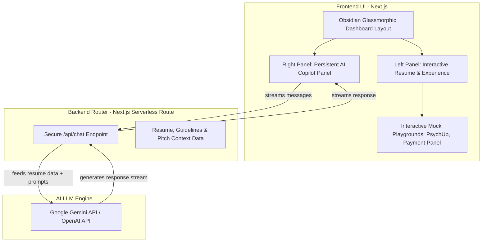

# Implementation Plan: AI-Copilot Developer Portfolio

This plan outlines the architecture, design philosophy, tech stack, and step-by-step implementation for building a state-of-the-art, highly visual developer portfolio. The core highlight of this portfolio is an **AI Recruiter Copilot**—a personalized, secure AI assistant trained on your resume that recruiters can interact with in real-time.

---

## 1. Goal & Vision
To build a premium, highly interactive portfolio that immediately captures attention. Instead of presenting a static list of links, the portfolio serves as an interactive "proof of work" dashboard. 

### Why this approach?
* **First Impression ("Wow" Factor):** Recruiters see a premium, dark-mode glassmorphic interface with fluid motion and micro-interactions.
* **Proactive Engagement:** Recruiters can converse directly with an AI trained specifically to pitch you, highlight your fintech/healthcare projects, and explain your technical skills.
* **Demonstrated Full-Stack React Capability:** Demonstrates clean architecture, secure server-side API integration, performance optimization, and modern AI tools in production.

---

## 2. Technology Stack & Core Tools

We will use a modern, industry-standard stack selected for performance, aesthetic flexibility, and rapid development:

| Layer | Technology | Purpose |
| :--- | :--- | :--- |
| **Core Framework** | **Next.js 14+ (App Router)** | Hybrid server/client rendering, file-based routing, and secure API routes. |
| **Language** | **TypeScript** | Strict typing for robust, self-documenting code. |
| **Styling** | **Tailwind CSS + Custom CSS Variables** | Flexible styling utility with custom animation design tokens. |
| **Motion** | **Framer Motion** | Physics-based micro-interactions, smooth reveals, and layout animations. |
| **Component Kit** | **shadcn/ui & Lucide React** | Unstyled, fully accessible, and customizable basic components. |
| **AI Integration** | **Vercel AI SDK** | Real-time chat streaming, caching, and state management utilities. |
| **AI Model** | **Google Gemini 1.5 Flash** | Ultra-fast responses, massive context window, and highly cost-efficient. |

---

## 3. Design System & Aesthetics

We will establish a strict, cohesive premium visual language:
* **Color Palette:** Deep obsidian blacks (`#0A0A0C`), sleek charcoal gray card backdrops (`#161619`), highlighted by neon hyper-purples (`#8B5CF6`) and glowing cyber-cyans (`#06B6D4`).
* **Glassmorphism:** Ultra-subtle border lines (`1px solid rgba(255,255,255,0.08)`), heavy background blurs (`backdrop-blur-xl`), and dark translucent gradients.
* **Typography:** Clean, geometric fonts like **Space Grotesk** or **Outfit** via Google Fonts.
* **Micro-interactions:** Hover-tilt effects on cards, magnetic click targets, and shimmering skeletons during loading states.

---

## 4. Proposed Application Architecture

---

## 5. Detailed Component Breakdown

### A. The Dashboard Layout (`src/app/page.tsx`)
A split-screen, grid-based container layout that remains fully responsive (stacks into a single-column layout on mobile devices).

### B. The Profile Panel (Left Side - 60% Width)
Contains tabbed views that standard recruiters expect, but styled with dynamic elements:
* **Hero Banner:** Dynamic animated gradient text, custom status badge (*"Available for High-Impact React Roles"*), and quick action buttons.
* **Skills Dashboard:** Structured categories showing not just percentages, but specific sub-tools (e.g., *"State Management: Redux Toolkit, Context API, React Query"*).
* **Experience Timeline:** Interactive cards for Lincpay and Freelance work.
* **Interactive Projects & Playgrounds:** 
  * Instead of screenshots, a tab will hold a live miniature simulator (e.g., a dummy **Bidding Panel** where users click "Bid" and watch state synchronize instantaneously, showcasing WebSocket-like frontend state management).

### C. The AI Recruiter Copilot (Right Side - 40% Width)
A floating, glassmorphic conversational widget that stays active as the recruiter scrolls.
* **Greeting Screen:** Display an introducing avatar (e.g., *"Chandrakant's AI Assistant"*) and quick suggestion chips.
* **Actionable Suggestion Chips:** Clickable pill buttons containing pre-configured high-impact questions like:
  * *"How does he handle WebSockets?"*
  * *"Summarize his mental health platform role."*
  * *"Is he open to relocation?"*
* **Message Hub:** Renders user prompts and AI streamed responses with a terminal-like text generation effect.
* **Secure API Call:** Calls the server endpoint behind the scenes, ensuring the API keys are kept entirely hidden from the browser.

---

## 6. Secure Backend Implementation

To ensure complete safety of your API credentials, all AI requests are proxied securely through a Next.js Serverless Route.

### API Security Flow:
1. Client makes an HTTP POST request to `/api/chat` passing the array of current chat logs.
2. The server-side route retrieves your private `GEMINI_API_KEY` from the system's environment variables.
3. The server reads a **Resume System Instruction** object containing your complete, optimized resume, your standard parameters (desired salary range, location, preferences), and instructions on how to represent you.
4. The server compiles the history, queries Google Gemini, and streams the responses securely back to the client.

---

## 7. Verification & Launch Plan

### Automated Verification:
* **Bundle Analysis:** Run `npm run build` to verify proper code-splitting and ensure the initial JS bundle size is minimal.
* **Responsive Validation:** Test layouts across multiple screen profiles using Chrome DevTools (iPhone, iPad, Full HD Monitor).

### Performance Audit:
* **Google Lighthouse:** Run audits to ensure score metrics hit:
  * **Performance:** 95+ (via lazy-loading and dynamic imports)
  * **Accessibility:** 98+ (via proper semantic markup)
  * **SEO:** 100% (using customized Meta tags and JSON-LD markup)

---

## 8. Open Decisions & Setup Questions

Before we write the first line of code, please confirm:
1. **API Key Availability:** Do you already have a Google Gemini API Key, or would you like to set up the code using placeholder configurations so you can add your key later?
2. **Interactive Mock Idea:** For the interactive playgrounds, does simulating a real-time **Auction Bidding Feed** (clicking "Place Bid" to trigger rapid local state updates) and a **Timed Psychological Test Engine** (answering questions with a live ticking timer) sound like the best way to showcase your projects?
